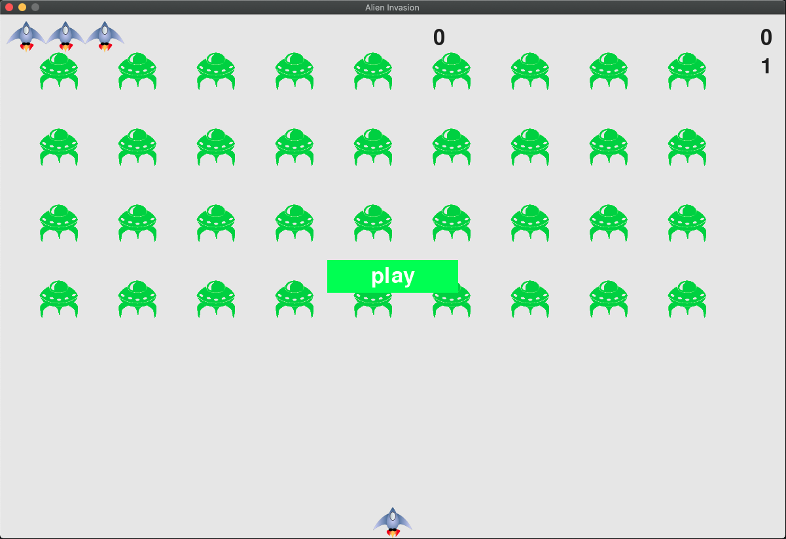

# Alien Invasion Game

## Introduction

Welcome to Alien Invasion! This is a simple arcade-style game where you, the player, control a spaceship and shoot down invading aliens. The game is built using Python and the Pygame library.

## Getting Started

To run the game, you'll need Python installed on your system along with the Pygame library. You can install Pygame using pip:

```
pip install pygame
```
Once you have Python and Pygame installed, you can run the game by executing the alien_invasion.py file:

```
python alien_invasion.py
```
## How to play
- Controls:
  - Use the left and right arrow keys to move your spaceship horizontally.
  - Use the spacebar to shoot bullets at the aliens.
  - Press Q to quit the game at any time.
- Objective:
  - Your objective is to shoot down as many aliens as possible while avoiding their projectiles.
  - The game becomes progressively harder as you advance through levels.
- Scoring:
  - You earn points for each alien you destroy.
  - The game keeps track of your highest score.
- Features
  - Simple and intuitive controls.
  - Increasing difficulty levels to keep the game challenging.
  - High score tracking.
Contributions

Contributions to the game are welcome! If you have any ideas for improvements or new features, feel free to fork the repository and submit a pull request.
